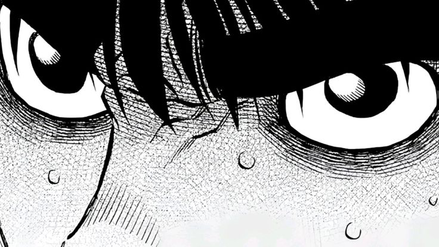

## hello, world

I build two kinds of things: **backend services that get systems talking** to each other, and **Apple apps** polished down to the last reflection.

## Things I've built

### [ShiftFestival · CRM integration service](https://github.com/IntegrationProject-Groep1/CRM)
`Node.js` `RabbitMQ` `Salesforce` `XML/XSD` `Docker`

The microservice that connects Salesforce to the rest of an event platform: registrations, sessions, checkout, invoicing, mailing and identity. It listens to RabbitMQ, validates each XML message against its XSD schema, updates Salesforce and publishes the follow-up events to the other services. Transient failures go through a retry queue, and invalid messages end up in a dead-letter queue.

A team project built as Docker microservices. I made 80+ commits to it: the wallet top-up, company membership and user update handlers, plus keeping our XML contracts aligned with the checkout and invoicing services.

### [Gameboxd](https://github.com/AyoubO22/Gameboxd) · Letterboxd, but for video games
`Swift` `SwiftUI` `MVVM` `Swift Charts` `GitHub Actions`

An iOS app to rate, review and track your games: a library with statuses, a play-session diary, stats, monthly goals and achievements to unlock, on top of RAWG's database of 500,000+ games. Over 18,000 lines of Swift with async/await, 26 unit tests, English and French localization, and a CI pipeline that builds and tests every push on macOS.

### [Holographic sticker workshop](https://github.com/AyoubO22/atelier-sticker-holo)
`JavaScript` `WebGL/GLSL` `Canvas 2D` `Swift` `AppKit` · **[Live demo](https://ayoubo22.github.io/atelier-sticker-holo/)**

Type your text, pick a font, colors, material and cut, then grab an edge and pull: the sticker lands in your clipboard as a transparent PNG. The glitter is a shader (Voronoi cells that catch the light depending on the angle), the die-cut comes from an exact Euclidean distance transform (Felzenszwalb & Huttenlocher), and the peel wraps the sticker around a cylinder that follows your cursor. No libraries, and the Mac app builds with plain `swiftc`, without an Xcode project.

### More

- **[Sanzo Outfit Matcher](https://github.com/AyoubO22/SanzoOutfitMatcher)** · Swift, SwiftUI. Matching outfits from the 348 color palettes of Japanese painter Sanzo Wada. It finds the closest color in CIE Lab space (ΔE\*), which follows how the eye perceives color.
- **[Corplol](https://github.com/AyoubO22/corplol)** · Python. A League of Legends team manager, as a desktop app and a Discord bot: balanced 5v5 teams that respect roles, match history, stats from the Riot Games API.
- **[HR-App](https://github.com/AyoubO22/HR-App)** · React, TypeScript. A recruitment platform (if you're a recruiter, you'll feel right at home): job requests, candidate files, interview scheduling and structured per-skill evaluations.

## Stack

**Backend** · Java, Spring Boot, Node.js, C#, .NET, PHP, Laravel, Python 
**Data** · SQL, PL/SQL, Oracle Database, APEX, MySQL 
**Integration** · RabbitMQ, Salesforce REST API (OAuth), XML and XSD 
**Apple** · Swift, SwiftUI, AppKit 
**Web** · TypeScript, React, Tailwind CSS, WebGL 
**Tooling** · Docker, GitHub Actions, Linux, Git
